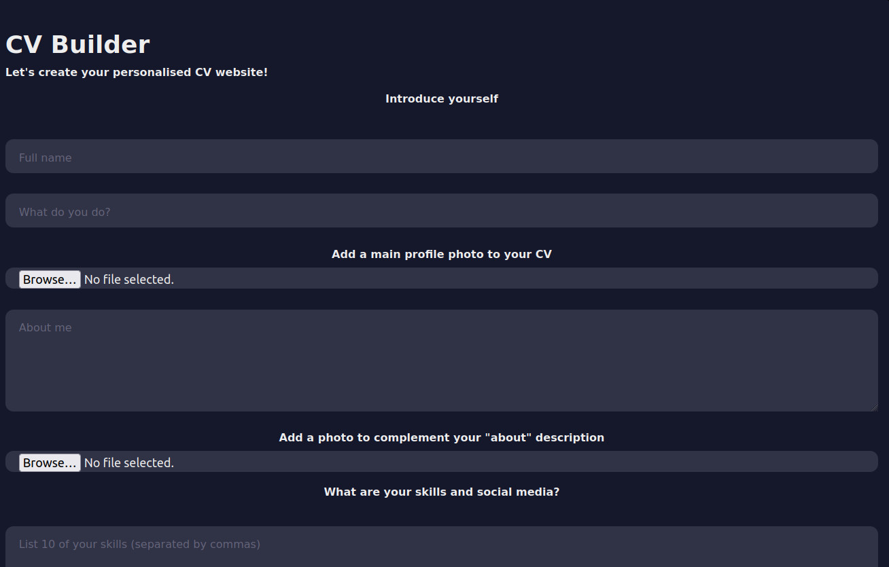

<div id="top"></div>
<!--
*** Thanks for checking out the Best-README-Template. If you have a suggestion
*** that would make this better, please fork the repo and create a pull request
*** or simply open an issue with the tag "enhancement".
*** Don't forget to give the project a star!
*** Thanks again! Now go create something AMAZING! :D
-->


<!-- PROJECT SHIELDS -->
<!--
*** I'm using markdown "reference style" links for readability.
*** Reference links are enclosed in brackets [ ] instead of parentheses ( ).
*** See the bottom of this document for the declaration of the reference variables
*** for contributors-url, forks-url, etc. This is an optional, concise syntax you may use.
*** https://www.markdownguide.org/basic-syntax/#reference-style-links
-->


<!-- PROJECT LOGO -->
<br />
<div align="center">
  <a href="https://github.com/Ad1thya-R/CV_site_Builder">
    
  </a>

<h3 align="center">CV Site Builder</h3>

  <p align="center">
    As an extension to designing my portfolio website (which you can visit at https://adithya.eu), I decided to create a tool that would allow anyone to turn their CV into a website. I used HTML5, CSS and vanilla JavaScript, without any libraries.
    <br />
    <a href="https://github.com/Ad1thya-R/CV_site_Builder"><strong>Explore the docs »</strong></a>
    <br />
    <br />
    <a href="https://ad1thya-r.github.io/CV_site_Builder">View Demo</a>
    ·
    <a href="https://github.com/Ad1thya-R/CV_site_Builder/issues">Report Bug</a>
    ·
    <a href="https://github.com/Ad1thya-R/CV_site_Builder/issues">Request Feature</a>
  </p>
</div>


<!-- ABOUT THE PROJECT -->
## About The Project

This project was a part of my university web programming course (CSE104), with the objective of developing a dynamic, interactive, standard compliant, website using client based programming (html, css, js). 

It was required that the project had the following elements:
* General structure defined clearly in valid current HTML.
* General design/appearance defined in valid CSS.
* Interaction with the user, based on JavaScript


<p align="right">(<a href="#top">back to top</a>)</p>


### Built With

* [HTML5](https://developer.mozilla.org/en-US/docs/Web/HTML)
* [CSS](https://developer.mozilla.org/en-US/docs/Web/CSS)
* [Javascript](https://javascript.com/)

<p align="right">(<a href="#top">back to top</a>)</p>


<!-- GETTING STARTED -->
## User Usage

The following section will describe a simple exploration of the functionalities of both the CV Builder site and the CV site from a User standpoint.


### CV Builder Usage

The user must input in all fields to have a fully functioning CV site. Unfortunately, I did not implement the ability to customise the number of project inputs, education inputs and experience inputs. 

The use must also separate all fields by commas where they are shown. This holds true with the skills, social media, projects, education and experience sections.

The image uploads are not truly restricted to a specific file format, however it is recommended for the user to use relatively smaller memory files, as the local Storage in which these files are kept is restricted in space and the loading time of the images when not cached on ones machine (i.e. when somebody loads the user's CV website for the first time) can be quite long.

### CV Site Usage

The user's interactions with the built CV website involve a few standard interactive features which have been implemented. Firstly, when hovering over any of the headers, the "bouncy text" animation gets triggered.

Then, the user can interact with the "theme switcher", which allows them to select one among 3 different default colour themes to set for their website. Their selection is then kept for any future visits of the webpage.

Other than that, they are able to access the various links to other pages with the many "See more" buttons.

## Project Development

I will briefly outline the main development steps 

### Development of the CV site

The CV Site was built using CSS Grid, with the inspiration for the design of the main page being that of a MacBook tab. I used grid as I felt that given the structure I had envisioned for my website, with the listing of multiple portfolio informations aligned.

I also made sure to use media queries in order to make the output CV site responsive on mobile, with changes to the way the grid behaves in order to have all elements properly responsive on a smaller screen. This was particularly important as I was implementing this either way on my personal portfolio website at https://adithya.eu

I then implemented a "bouncy text" animation when the user hovers over the text (inspired by https://bobangajicsm.github.io/portfolio/). I implmented this using CSS transform with the following parameters:

   ```css
    @keyframes animate {
      25%{
          transform: scale(0.8,1.3);
      }
      50%{
          transform: scale(1.1,0.8);
      }
      75%{
          transform: scale(0.7,1.2);
      }
     }

   ```
   The other "big" interactive feature as far as the CV Website is concerned is the implmentation of the theme switcher. There were 2 main elements to achieving a working theme switcher. Firstly, I implmented all of the main colours of the website in a variable based manner in CSS, as follows:
   
   ```css
    :root{
      --mainColor:#eaeaea;
      --secondaryColor:#fff;

      --borderColor:#c1c1c1;

      --mainText:black;
      --secondaryText:#4b5156;

      --themeDotborder:#24292e;

      --previewColor:rgba(234,234,234,0.8);
      --prevShadow:#01426a;

      --polytechnique:rgba(255,255,255,0);
      --bouncyhover:#01426a;
      --linkcolor: #01426a;
    }

   ```
   This is crucial to allow us to link another css file with variable defined colours (same variable names, different colours).
   
   Then, I needed to implement a JavaScript function to actually allow for the theme to switch, which would allow for the themes to switch as well as saving the user's input to local Storage such that it can be recovered whenever they reload the page. This can all be seen in the <a href="https://github.com/Ad1thya-R/CV_site_Builder/blob/main/JS/script2.js">script2.js</a> file.
   
   Finally, for the implementation of the form, I linked to an external service to take care of the server side needs called <a href="https://formspree.io/">FormSpree</a> 
   
   ### Development of the CV Site Builder
   
   After developing a reasonable good CV website, I moved onto implementing the Builder. In order to do this, I decided that as opposed to using server side programming (like using PHP), I would stick to the content of the course of CSE104 and implement the builder through storing User input as JSON objects in local storage.
   
   Initially, in order to do this, I wrote some javascript to create a dictionary which would save all of the user's input with all of the keys being the different sections and all values being defined as the user's input. This was done as follows in the <a href="https://github.com/Ad1thya-R/CV_site_Builder/blob/main/JS/script.js">script.js</a>  file:
   
   ```js
   const addInfo = (ev)=>{
        ev.preventDefault();  //to stop the form submitting
        let information = {
            id: Date.now(),
            name: document.getElementById('name').value,
            about: document.getElementById('about').value,
            aboutlong: document.getElementById('aboutlong').value,
            skilllist: document.getElementById('skilllist').value,
            social1: document.getElementById('social1').value,
            social2: document.getElementById('social2').value,
            social3: document.getElementById('social3').value,
            project1: document.getElementById('project1').value,
            project2: document.getElementById('project2').value,
            project3: document.getElementById('project3').value,
            education1: document.getElementById('education1').value,
            education2: document.getElementById('education2').value,
            experience1: document.getElementById('experience1').value,
            experience2: document.getElementById('experience2').value,
            experience3: document.getElementById('experience3').value,
            formspree: document.getElementById('formspree').value,
        }
        informations.push(information);
        document.forms[0].reset(); // to clear the form for the next entries
        //document.querySelector('form').reset();

        //saving to localStorage
        localStorage.setItem('CV', JSON.stringify(informations) );
    }
    document.addEventListener('DOMContentLoaded', ()=>{
        document.getElementById('btn').addEventListener('click', addInfo);
    });
    
   ```
Then, in order for the input to be converted back to respond to the website, for each section, I implemented some more javascript code such that all user input would appear on the CV site when the user presses submit. This first involved converting the JSON object back to a string and then modifying the specific div that the piece of information is for. An example for the "About Me" section is as follows:   

   ```js
    <p id="about-long"></p>
    
    <script>
       var aboutlong = document.getElementById('about-long')
       aboutlong.innerHTML=CV[CV.length-1].aboutlong

       let aboutphoto = JSON.parse(localStorage.getItem('aboutphoto'))
       let aboutimg = document.getElementById('aboutphoto')
       aboutimg.src=aboutphoto
    </script>
   ```
   This process was then repeated with all sections, with some proving slightly trickier than others, with the need of loops iterating over the string input of the user. All such implementations can be found in the <a href="https://github.com/Ad1thya-R/CV_site_Builder/blob/main/built.html/">built.html</a> file.
   
<p align="right">(<a href="#top">back to top</a>)</p>


<!-- CONTRIBUTING -->
## Contributing

Contributions are what make the open source community such an amazing place to learn, inspire, and create. Any contributions you make are **greatly appreciated**.

If you have a suggestion that would make this better, please fork the repo and create a pull request. You can also simply open an issue with the tag "enhancement".
Don't forget to give the project a star! Thanks again!

1. Fork the Project
2. Create your Feature Branch (`git checkout -b feature/AmazingFeature`)
3. Commit your Changes (`git commit -m 'Add some AmazingFeature'`)
4. Push to the Branch (`git push origin feature/AmazingFeature`)
5. Open a Pull Request

<p align="right">(<a href="#top">back to top</a>)</p>


    © 2022 GitHub, Inc.

    Terms
    Privacy
    Security
    Status
    Docs
    Contact GitHub
    Pricing
    API
    Training
    Blog
    About

